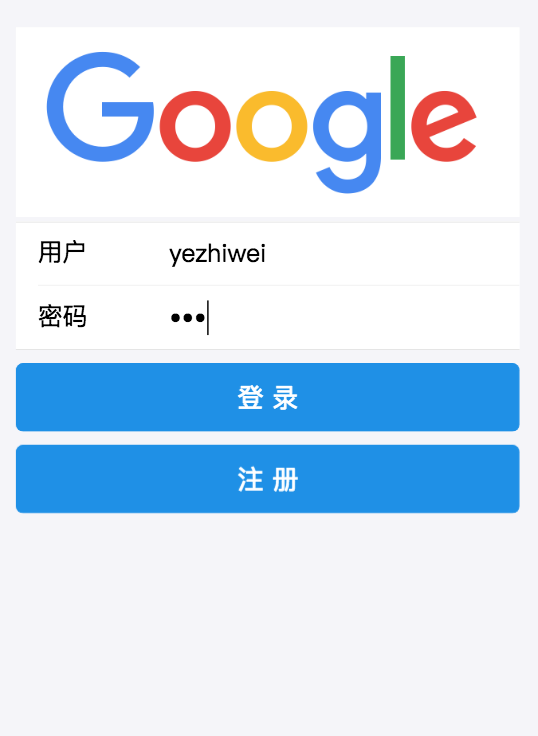
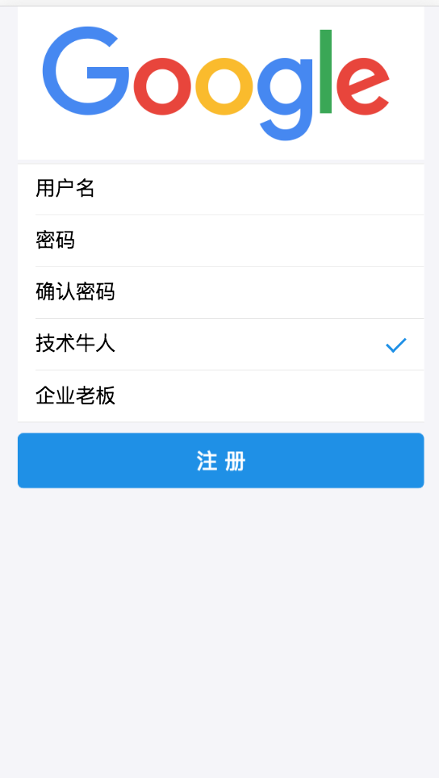
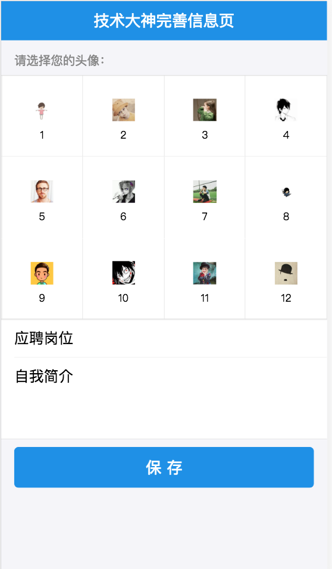
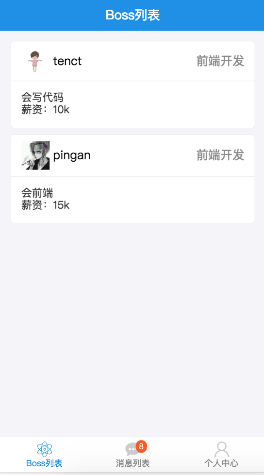
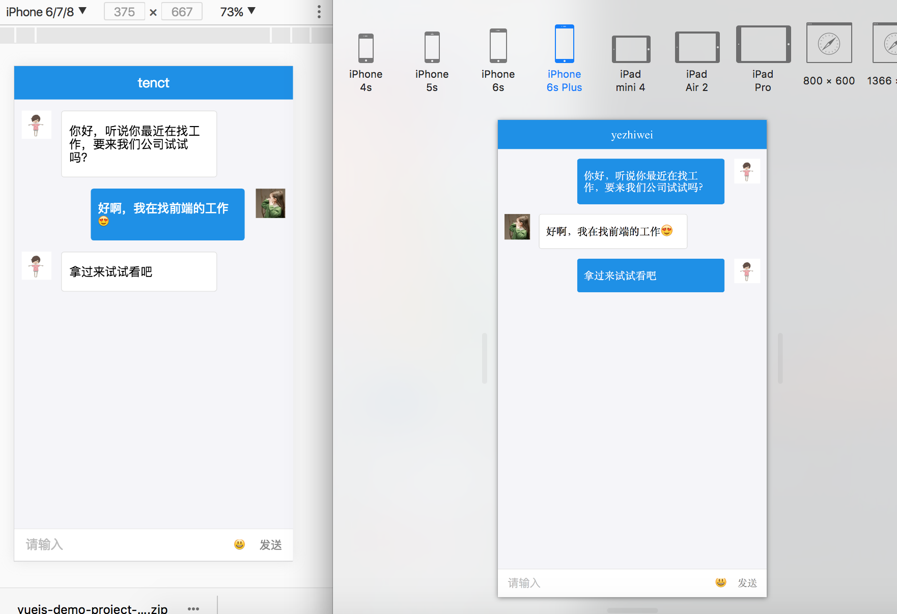

# 找工作的聊天web

### 技术栈 

react，redux，node，mongoose，axios，antd-mobile，socket.io

使用方法：
> 1. 安装 npm install

> 2. 启动 mongodb

bin目录下输入 `sudo ./mongod`，然后打开新的命令行输入`./mongo`

> 3. 在项目目录下启用输入npm run start 本地起用服务。

> 4. 在项目目录的server文件夹下输入`nodemon server.js`启用本地后台服务。

### 项目介绍

项目页面：

1. 登录页

2. 注册页

3. 个人信息补全页

4. 人员列表页

5. 聊天页面

